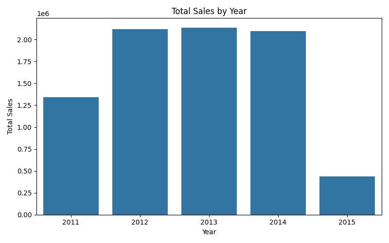
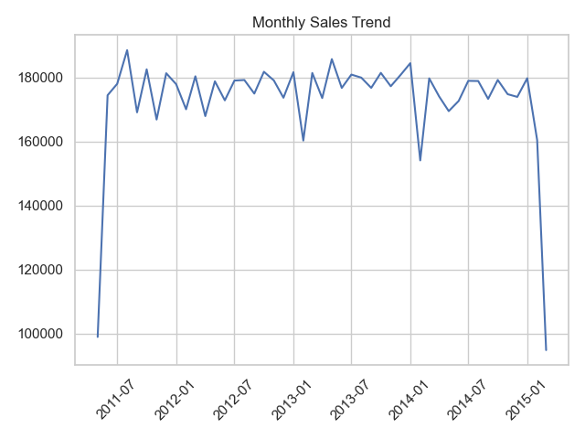
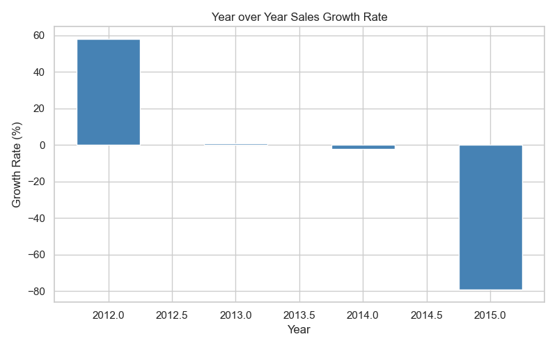
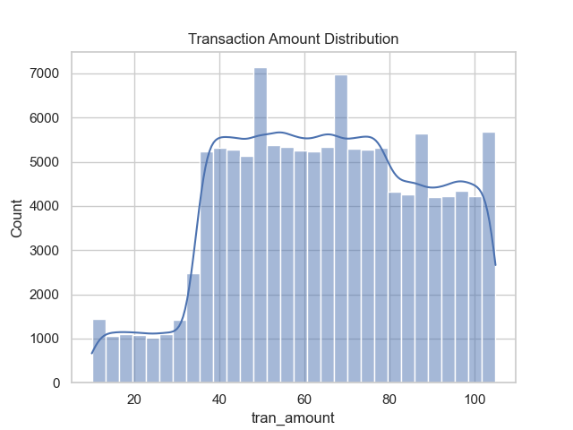
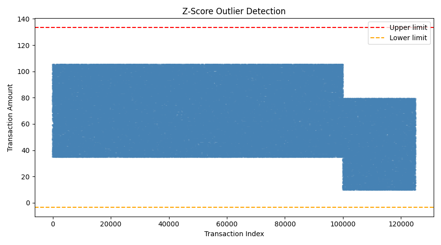
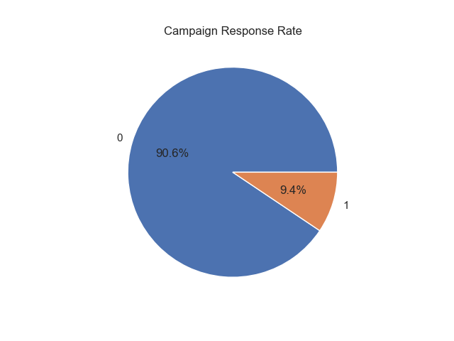
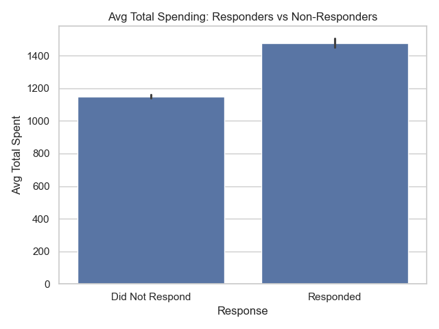
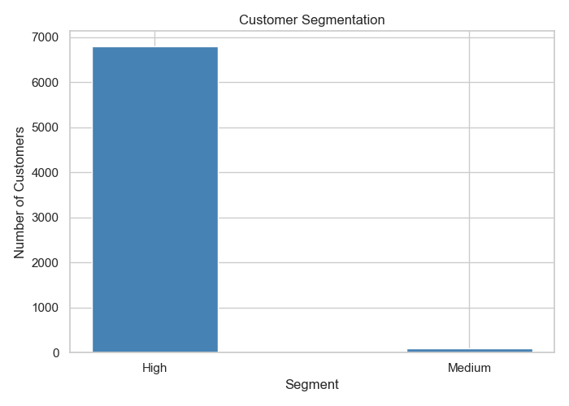
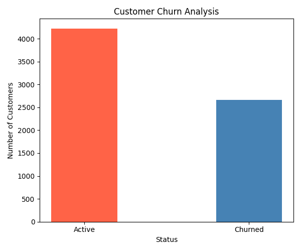

# Retail Customer Analysis

**End-to-end retail data analysis pipeline · 125,000 transactions · 6,879 customers · 2011–2015**

---

## Key Questions Investigated

1. How did sales trend year-over-year and month-over-month from 2011 to 2015?
2. Who are the highest-value customers, and what do they look like?
3. Do customers who respond to marketing campaigns actually spend more?
4. What is the churn rate, and how many customers are at risk of being lost?

---

## Key Findings

### Sales Trend — Growth Then Collapse
Sales grew sharply from 2011 to 2012 (+58% YoY), stayed stable through 2013–2014, then crashed by nearly **80% in 2015**. Monthly data shows consistent performance in the ₹170K–185K range, with the collapse concentrated at the end of 2015.

### Campaign Response Rate
Only **9.4%** of customers responded to the marketing campaign — but those who did responded with their wallets.

### Responders Spend More
| Group | Avg Total Spent |
|---|---|
| Did Not Respond | ₹1,150 |
| Responded | ₹1,460 |

> Responders spend **~27% more** on average. Targeting high spenders for campaigns = significantly better ROI.

### Customer Churn
| Status | Customers |
|---|---|
| Active | ~4,200 |
| Churned | ~2,670 |

> **38.7% churn rate** — nearly 1 in 3 customers made no purchase after January 2015. Retention should be a top business priority.

### Data Quality
Zero outliers detected across all 125,000 transactions using Z-score analysis (±3 standard deviation threshold). Data was clean and reliable for analysis.

---

## Project Structure

```
Retail_Analysis_Project/
├── Phase1_2_DB_Setup_and_Cleaning.sql   # DB setup, data load, cleaning
├── phase2_cleaning.ipynb                # Python verification + outlier detection
├── Phase3_Data_Analysis.sql             # SQL EDA queries
├── Phase3_Data_Analysis.ipynb           # Python EDA + all charts
├── Phase4_Reporting.ipynb               # Multi-sheet Excel report generation
├── Retail_Analysis_Report.xlsx          # Final Excel output
└── data/                              # All saved visualizations
```

---

## What's Inside

### Phase 1 & 2 — Database Setup & Cleaning (SQL)

**Dataset:** 2 raw CSVs → MySQL database with 3 tables

| Issue Checked | Result |
|---|---|
| Null / missing values | None found |
| Duplicate rows | None found |
| Invalid transaction amounts (≤ 0) | None found |
| Date stored as text string | Converted using `STR_TO_DATE()` |
| Response column validity (only 0 or 1) | Confirmed clean |

Built a `customer_total_sales` summary table aggregating total spend, transaction count, and first/last purchase date per customer — used across all downstream analysis.

### Phase 2 — Python Verification & Outlier Detection

- Connected to MySQL via SQLAlchemy, pulled all tables into Pandas
- Verified row counts and data types matched expectations
- Applied **Z-score outlier detection** on transaction amounts
- **Result: 0 outliers** across 125,000 transactions — all within ±3 standard deviations

### Phase 3 — Exploratory Data Analysis (SQL + Python)

| Analysis | Tool |
|---|---|
| Yearly & monthly sales trends | SQL + Matplotlib |
| YoY growth rate | Pandas `pct_change()` |
| Transaction amount distribution | Seaborn histogram |
| Top 10 customers by spending | SQL + Pandas |
| Campaign response rate | SQL + Matplotlib pie chart |
| Responders vs non-responders spending | Seaborn bar chart |
| Customer segmentation (Low/Medium/High) | SQL + Matplotlib |
| Customer churn analysis | Pandas + Matplotlib |

### Phase 4 — Excel Reporting

Generated a multi-sheet Excel workbook using `openpyxl`:

| Sheet | Contents |
|---|---|
| Yearly Sales | Total sales and transaction count per year |
| Monthly Sales | Monthly breakdown with period labels |
| Top 10 Customers | Highest spenders with full transaction details |
| Segments | Customer count by frequency segment |
| Response | Campaign response distribution |
| YoY Growth | Year-over-year sales growth rate |
| Churn | Active vs churned customer count |

---

## Visualizations

### Sales by Year


### Monthly Sales Trend


### Year-over-Year Growth Rate


### Transaction Amount Distribution


### Z-Score Outlier Detection


### Campaign Response Rate


### Responders vs Non-Responders — Avg Spending


### Customer Segmentation


### Customer Churn Analysis


---

## Libraries Used

| Library | Purpose |
|---|---|
| `pandas` | Data manipulation and aggregation |
| `matplotlib` | Bar charts, line charts, scatter plots |
| `seaborn` | Distribution plots, styled bar charts |
| `sqlalchemy` + `pymysql` | Python–MySQL connectivity |
| `openpyxl` | Excel report generation |

---

## How to Run

```bash
# Step 1 — Set up the database
# Run Phase1_2_DB_Setup_and_Cleaning.sql in MySQL Workbench

# Step 2 — Run notebooks in order
jupyter notebook phase2_cleaning.ipynb
jupyter notebook Phase3_Data_Analysis.ipynb
jupyter notebook Phase4_Reporting.ipynb
```

> Make sure your MySQL credentials are configured before running.

---

## Conclusion

Three things stood out clearly from this analysis:

**1.** The 2015 sales collapse is the biggest signal in the data — an ~80% drop in a single year needs investigation. Whether it's a data issue or a real business event, it can't be ignored.

**2.** Campaign targeting strategy matters more than campaign volume — responders already spend 27% more, so focusing campaigns on high-spend segments would improve returns without increasing spend.

**3.** Churn at 38.7% is high enough to hurt long-term growth — retaining even a fraction of churned customers through re-engagement would have a measurable revenue impact.

---

*Data Analytics Project · Avika · May 2026*
